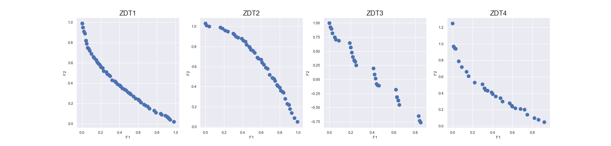

## MOEA/D: Multiobjective Evolutionary Algorithm Based on Decomposition
-This is a python implementation of MOEA/D [1] with tchebycheff decomposition function, "MOEAD.py".
-As in the original paper, was used Simulated Binary Crossover and Polynomial Mutation, "GeneticOperators.py".
-It was tested on ZDT 1-4 [2], "BenchmarkFunctions.py".

-Obs: For now, just tested for 2 objectives functions. :)

## Experiments Results
-H =299
-Generations: 2000

## References
[1] Q. Zhang and H. Li, "MOEA/D: A Multiobjective Evolutionary Algorithm Based on Decomposition," 
    in IEEE Transactions on Evolutionary Computation, vol. 11, no. 6, pp. 712-731, Dec. 2007.
[2] Zitzler, E., Deb, K., Thiele, L.: “Comparison of Multiobjective Evolutionary Algorithms: 
    Empirical Results”, Evolutionary Computation, vol. 8, n° 2, pp. 173-195, 2000
