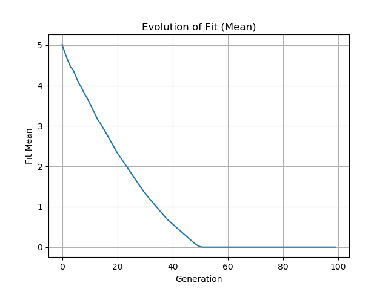
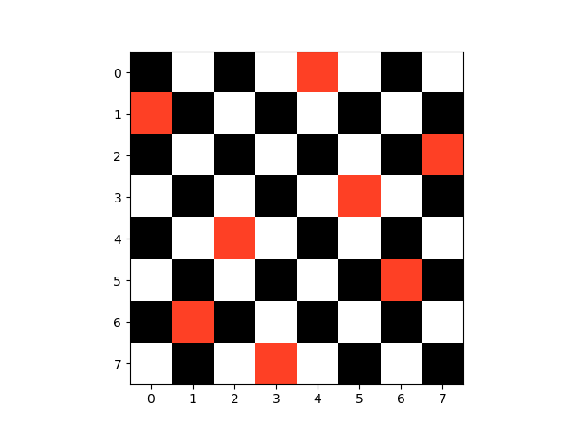

This is a python simple solution genetic algorithm for the problem of 8 queens.
This is a mathematical problem of placing 8 queens in a chessboard and no two queens is able to capture each other.

In this implementation, it is possible to change the size of the board, and consequently the number of queens. It is a simple GA with order crossover and swap mutation.

The figure below shows the evolution of the conflits during each generation, until the last generation with 0 conflicts

The next figure shows the final chessboard with 0 conflicts

